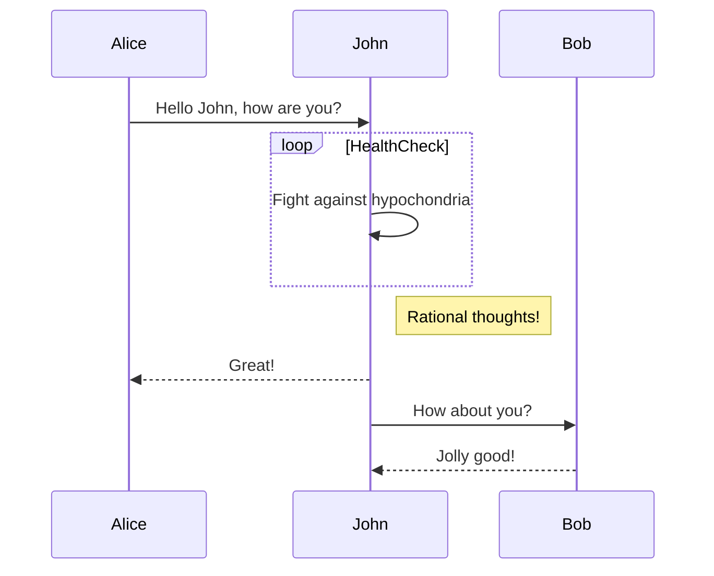

> Example tip prompt
{: .prompt-tip }
> Example info prompt
{: .prompt-info }
> Example warning prompt
{: .prompt-warning }
> Example danger prompt
{: .prompt-danger }

`inline code`

`/path/to/a/file.ext`{: .filepath}

```yaml
key: value
```

```shell
echo 'No more line numbers!'
```
{: .nolineno }

```shell
# content
```
{: file="path/to/file" }

The following require math: true in metadata

$$
\begin{equation}
  LaTeX_math_expression
  \label{eq:label_name}
\end{equation}
$$

The following require mermaid: true in metadata

