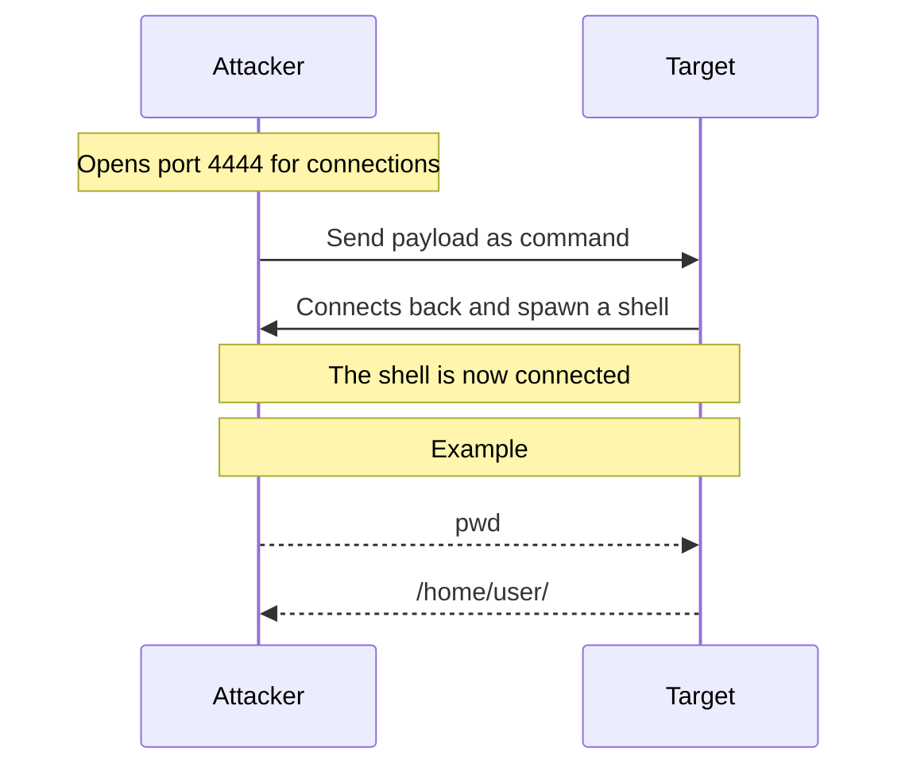
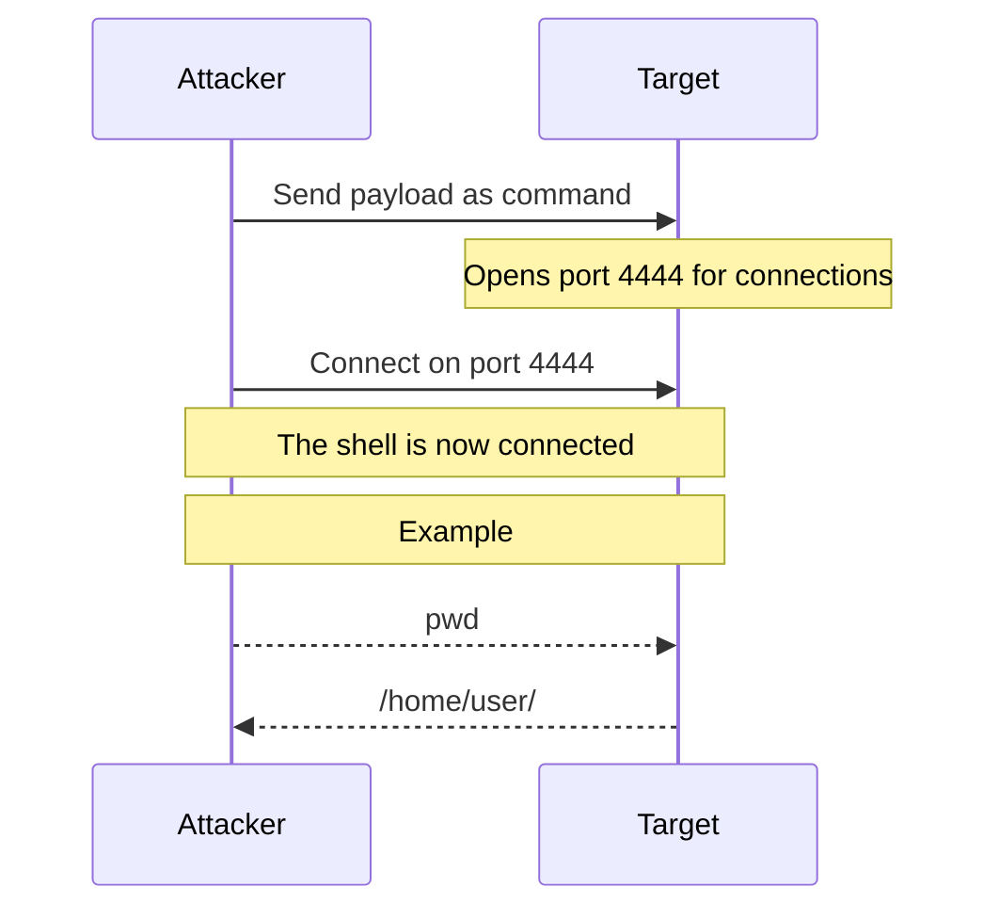

Durring your times _hacking_ through your target defenses, you will often come accross remote shells (reverse shells (revshells) and bind shells).

These are simply terminals, bound to a remote machine.

These are incredibly usefull, and will help you for both CTFs and Red Teaming.

For both revshell and bind shell, we will use [https://www.revshells.com/](https://www.revshells.com/).

For that tutorial, I'll be using a Linux machine (running Ubuntu 22.04).

# Terminology

## Actors

We will talk about 2 actors for that blog:

- The `attacker`, `master` or `local machine`: It's you
- The `target`, `remote machine`: It's the machine you are trying to get a remote shell on

## Shells

It is really important not to confuse reverse shells, and remote shells.

A reverse shell is a remote shell, but a remote shell is not always a reverse shell.

> A remote shell is a shell bound to a remote machine.

> A reverse shell is a type of remote shell where the target connects back to the "master" of the connection

> A bind shell is a type of remote shell where the target waits for the "master" to connect.

Reverse shells are often more used on CTFs.

# Setup DVWA

For this tutorial, we will be using the awesome tool [DVWA](https://github.com/digininja/DVWA).

Here, we will see how to set it up through [Docker](https://www.docker.com/) to minimise the risks while still having a "real life example".

Run the following to clone, and deploy DVWA within docker (in a containered and secure environement):

- `git clone https://github.com/digininja/DVWA`
- `cd ./DVWA/`
- `docker compose up` (note: if you get a permission denied, retry with `sudo`)

Once the compose is running, you should be able to access the DVWA platform at [http://127.0.0.1:4280](http://127.0.0.1:4280)

{: .w-75 .shadow .rounded-10 }
_Accessing the DVWA container_

The default credentials are `admin` and `password`

You will end up on a page with all the setup instructions.

On it, you can simply press the `Create / Reset Database` button to set everything up for us.

Once loged in again, we can see (on the left panel) all the challenges DVWA provide. We won't dive into them (today ?), and will only play with the "Command Injection" one.

{: .w-75 .shadow .rounded-10 }
_The Command Injection challenge on DVWA_

This it where we will be able to exploit a web vulnerability to execute commands.

However, if you look at the screenshot, on the bottom left, you can see `Security Level: impossible`.

This is a feature of DVWA, where you can train on different levels of protections.

As we are not learning Web Security, but remote shells, we don't want to deal with protections.

You can change the security level on the `DVWA Security` tab.

Once the level is on "Low", we can start exploiting !

# [REVERSE SHELL] Theory

The idea behind the reverse shell is easy:

The attacker opens a port, and "force" the target to connect to it while spawning a shell.

# [REVERSE SHELL] Setup

First things first, we will dive into how we can setup a revshell.

For that, we will first need to find our IP address.

We will be using the command `ifconfig`

{: .w-75 .shadow .rounded-10 }
_Running ifconfig to retreive our IP address_

> Wow, there are a lot of IPs, which one is mine ?
{: .prompt-info }

Well, all of 'em.

This is due to _interfaces_.

For example, you can see "docker0" at the top.

This is an interface, created by [Docker](https://www.docker.com/) for each of it's containers.

> But then, how can I choose which IP to use ?
{: .prompt-info }

Well, it depends on where your target is:

If your target is accessible through a VPN (if you are targeting a CTF on [TryHackMe](https://tryhackme.com/) or [HackTheBox](https://app.hackthebox.com/) for example), you would probably use the tun0 IP.

For our example, we will be using our `docker0` IP, as DVWA is deployed within docker.

{: .w-75 .shadow .rounded-10 }
_Using revshells.com to generate a listener and payloads_

On the "port" field, you can put whatever number you want, on range 1-65535.

Note, however, that port 1-1024 might be used by processes on your PC, and will require root access to use.

Once that's done, you can find your _listener_ on the top right, and your _payloads_ on the bottom.

The _listener_ is the command you need to run to open your port (to listen for the remote connection), and the _payloads_ are commands the target need to run to "spawn" the revershe shell.

Ok, let's dive into it !

# [REVERSE SHELL] Spawning a revshell

On that challenge, the way you inject commands, is by prepending `; ` at the beggining of commands.

Let's spawn a reverse shell !

First of all, let's grab our _listener_ on [https://www.revshells.com/](https://www.revshells.com/).

{: .w-75 .shadow .rounded-10 }

Next, let's grab our payload

> Ok, but there are like 50 of them, which one do I choose ?
{: .prompt-info }

Great question !

All the payload virtually work.

But, they will depend a lot on target installed programs, configurations, versions...

You will learn, while practicing, which ones usually works, if you need to change part of them...

For example, let's take 3 of them so we can figure out which one to use :

- `Bash read line`
- `Python3 shortest`
- `Perl`

## Bash read line

Let's send it !

While having our listener active, let's send a command !

The command will, as stated, be of format "; {payload}"

{: .w-75 .shadow .rounded-10 }
_Injecting a sample "ls" as a PoC_

Ok, executing commands work.

Let's now inject our `Bash read line` payload the same way !

{: .w-75 .shadow .rounded-10 }
_Trying to inject the Bash read line payload_

As you can see, nothing happens.

As stated before, payloads are **highly** dependent on the machine.

Bash read line probably just doesn't work on that machine.

Trial and error is the base of learning &#128521;

## Python3 shortest

Python3 shortest is a payload that works a lot of the time.

Before trying to send it downrange, let's try to predict if it will work.

For that, we first want to confirm that the `python3` command is available.

{: .w-75 .shadow .rounded-10 }
_Running "which python3" to find the python3 command_

As you can see, the python3 command isn't installed.

Based on that, we can predict that the python3 payload won't work.

If you want, you can try and see that, indeed, it doesn't work.

## Perl

Like `python3`, let's see if the `perl` command exists.

{: .w-75 .shadow .rounded-10 }
_This time, the command exists_

Ok, as the command exists, the payload might work.

{: .w-75 .shadow .rounded-10 }
_We run the perl payload on the DVWA machine_

We can see that, when running the payload, our browser freezes, and something happens on our listener

<a name="receiving-revshell" href="#"></a>

{: .w-75 .shadow .rounded-10 }
_We receive a connection on our listener_

Yey !

The shell we got is a _reverse shell_.

Commands executed on that shell are sent to the remote machine, which execute them, and send us the output back.

Let's break down what we did :



# [BIND SHELL] Theory

Bind shell will do the oposite of reverse shells.

The command sent to the target will open one if it's port, and we will be able to connect to it to get our shell.

One key advantage of that methode, is that we don't send our IP within the payload.

But, it requires us to access the machine in order to retreive our shell.

# [BIND SHELL] Setup

As stated, we need to access the remote machine directly.

For that, we will need to retreive the exact IP of the container.

The easiest way to do so, is to look at the first line when our [listener received connection](#receiving-revshell)

You can see `Connection received on 172.18.0.3 60076`.

Here, `172.18.0.3` is our target's IP (it can be different for you).

> But, we accessed the DVWA machine using the IP `127.0.0.1` on our browser, isn't it that the IP ?
{: .prompt-info }

If that's a question you really asked yourself, that's really good !

In fact, we were able to access it on our browser using the IP `127.0.0.1` (and port `4280`) only thanks to docker.

If you paste the IP of your revshell (in my case `172.18.0.3`) onto your web browser, you should see the exact same DVWA interface.

{: .w-75 .shadow .rounded-10 }
_We can access the website through another IP_

Docker just _forwards_ the connection to our `127.0.0.1` IP on port `4280`.

There is no need to dive too deep on this, let's focus on our bind shell.

Going back to [https://revshells.com](https://revshells.com), we can check out the `Bind` tab, and see that there are a lot less payloads.

{: .w-75 .shadow .rounded-10 }
_There are a lot less bind shell payloads_

> Ok, so we just grab our listener, our payload, and do the same as the revshell ?
{: .prompt-info }

Well, for bind shells, the listener _is_ the payload.

Let's demonstrate that

# [BIND SHELL] Spawning a bind shell

As we stated before, `python3` isn't installed, but perl is.

Let's then copy the perl payload and execute it on DVWA

> Don't forget the `; ` at the beggining !
{: .prompt-tip }

{: .w-75 .shadow .rounded-10 }
_Running the perl payload makes the website load_

> ... And ?
{: .prompt-info }

And... that's it !

Our bind shell is executed successfully !

> But wait, where is my shell ?
{: .prompt-info }

As stated before, the bind shell _binds_ on a port, and wait for the master to _connect_ to it.

The bind shell is awaiting us to _connect_, now.

To do so, we will use `nc` (NetCat), the same tool used for our previous listener.

The command is simply `nc {our target IP} {our bind shell port}`

In my case, the target IP was `172.18.0.3` and the port I choose was `4444`.

{: .w-75 .shadow .rounded-10 }
_Connecting to the bind shell_

As you can see by the `can't access tty; job control turned off`, we successfully connected to the bind shell !

Let's see what we did :



As you can see, the main difference is that no "connection back" is required.

This might be usefull if the target have firewall rules, for example.

# Upgrading both reverse shells and bind shells

We learned 2 ways to gain a remote shell on a machine (of course, the way you inject commands will vary depending on the machines).

Now, we have a remote terminal.

But, it is not _stable_, and for multiple reasons.

## Problems

### clear

Usually, running `clear` will give you the following output :

`TERM environment variable not set.`

This can simply be fixed by running
```bash
export TERM=xterm
```

or, if you like colorized outputs

```bash
export TERM=xterm-256color
```

### sudo

DVWA does't come with the `sudo` command installed.

I installed it on my DVWA instance, and when I went to run it from within my reverse shell, here is the output :

{: .w-75 .shadow .rounded-10 }
_Running sudo within a revshell_

As you can see, sudo cryes about the fact that this is not a real terminal.

And, in fact, it is not.

In reallity, it's a child process of a non interactive process.

This is often the case on CTFs.

### Ctrl+C

Let's say, within your reverse shell, you run an infinite loop by mistake.

For example, you run the `yes` command.

Normally, you would press Ctrl+C to stop the process.

Unfortunatly, here, you can't.

Why ?

Because pressing Ctrl+C would stop the process _on your machine_.

It would stop the `nc -lvnp`.

This would, in the end, kill the reverse shell.

### Arrows

You now ran a really long command, which runs a lot of tests and stuff.

But, you want to change one parameter.

By pressing one of the arrow keys, you should see one of

```
^[[A
^[[B
^[[C
^[[D
```

This due to the same reason you can't use Ctrl+C, and also, usually because the shell you are using is `sh` which doesn't support arrows

## Solutions

Fortunatly, there are solutions :

First thing, let's spawn a _real_ shell.

This can be done using multiple commands (You can find a list of them [here](https://wiki.zacheller.dev/pentest/privilege-escalation/spawning-a-tty-shell))

The 2 I use the most are :

- `python3 -c 'import pty; pty.spawn("/bin/bash")'` (Which doesn't work in our case, as python3 isn't installed)
- `/bin/bash -i`

Once that's done, sudo should work.

But arrows still doesn't work, as well as Ctrl+C

These will require client size handeling.

For that, press `Ctrl+Z` (not `Ctrl+C`) to put the `nc` process to the background.

Next, let's enable "raw mode" and disable input display.

The command for that is `stty raw -echo`.

When running that command, your key presses will no longer apear.

While "blind", you need to run the `fg` command to bring back the background process (our `nc` listener).

Once that's done, you should have a "fully functional" remote shell: arrow keys, Ctrl+C, tab...

All that should work.

**Note:** If you use a shell (in your client) that does tty shenanigans, you might want to chain the commands:

If, for example, you use Zsh (which you should, it's a great shell), the shell will mess with your stty configuration.

For that reason, it's best to chain the `stty raw -echo` and `fg` as `stty raw -echo; fg` in order to execute both the commands without the shell messing with it.

## Alternatives

There are tools that can help you setup interactive shell.

### Other listener

On [https://revshells.com](https://revshells.com), you can change the listener.

- `socat (TTY)`: Socat TTY let's you set the client side, so you don't need to run the `stty...`
- `pwncat`: [pwncat](https://pwncat.readthedocs.io/en/latest/) is a really good listener that handle a lot for you, like some privilege escalations, persistance, file upload/download...
> pwncat is really powerfull, however it's really advanced, and it might end up doing things you don't understand. I only recomand using the features you understand, if you want to progress &#128521;
{: .prompt-warning }

### Process tree

That's a quick tip:

If you are in a CTF, or you don't care about hiding yourself, I advise you to spawn multiple nested shells:

{: .w-75 .shadow .rounded-10 }
_Process tree, through custom script_

This is so if you type `exit`, or press `Ctrl+D` by mistake, you have a safety nest.

You simply have to run bash within itself multiple times for that, no need to re-do the reverse shell each time &#128521;
