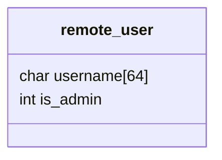

## Welcome !

Today, we will dive into the world of low-level exploitation.

For this introduction, we will break into a simple C program containing a simple vulnerability.

> Feel free to use the comments section if you don't understand something !
{: .prompt-tip }

## What will you need ?

For this simple subject, you won't need much :

- A computer, preferably running Linux (it should work on Windows as well, but I can't test that right now)
- A C compiler (we will use GCC most of the time, but you should have the same kind of results if you use CLang, or others)
- The desire to learn low-level exploitation !

---

## Setup

Okay, let's start with the setup.

First of all, here is the code we will be exploiting today :

```c
#include <stdio.h>
#include <stdlib.h>

void clear()
{
    printf("\33[H\33[2J\33[3J");
}

void authorize_shell()
{
    printf("You won !\n");
    system("/bin/bash"); // Change that if you are on windows !
}

void check_if_authorised()
{
    struct {
        char username[64];
        int is_admin;
    } remote_user;
    remote_user.is_admin = 0;
    
    gets(remote_user.username);
    
    if (remote_user.is_admin)
        authorize_shell();

    clear();
    
    printf("+-----------------+\n");
    printf("|                 |\n");
    printf("| Access denied ! |\n");
    printf("|   Stay out !!   |\n");
    printf("|                 |\n");
    printf("+-----------------+\n");
}

int main()
{
    check_if_authorised();
}
```

Wow, that's a lot of code !

Let's first understand what it does, and then start exploiting it !

---

# Code explanation

First, this is C code.

As a low-level exploiter, this is a language you should familiarize yourself with.

We will also look at assembly code, but this will be a bit later.

At the beginning of the code, we see some `#include` statements.

These simply retrieve code from other files (here `stdio.h` and `stdlib.h`), and add them to your code.

> But, there is no `stdio.h` or `stdlib.h` file here ! Where are them ?
{: .prompt-info }

Great question !

These files are created by the C compiler when it's installed.

They are often stored on `/usr/include` folder.

They are not really important, and simply prevent compilation warnings

Next, we see multiple **functions** defined.

There are:
- `clear`: simply clear the screen, we don't need to worry about it too much
- `authorize_shell`: we can see that this function calls `/bin/bash`, this is our target !
- `check_if_authorised`: this is the only function calling our target function, `authorize_shell`
- `main`: just calls `check_if_authorised`

Okay, so we need to call `authorize_shell`.

Let's see where it's called

```c
if (remote_user.is_admin)
    authorize_shell();
```

So, we need our `remote_user` to be admin, and then we win !

> Okay, but where is our remote_user set as an admin ?
{: .prompt-info }

Well... nowhere.

And, that's a problem.

But first, _what_ is that `remote_user` ?

If we come back to the top of the `check_if_authorised` function, we can see :

```c
struct {
    char username[64];
    int is_admin;
} remote_user;
```

> Wait, what is that, a `struct` ?
{: .prompt-info }

Well, it's simply multiple variables put together, and treated as a single variable by the compiler.

You could treat a struct as a box, containing other boxes (variables).

In memory, the struct remote_user look like this :



Were is_admin is put right after username.

> And, why is it usefull ?
{: .prompt-info }

By itself, there is nothing interesting here.

But, if we look 3 lines under that struct, we can see

```c
gets(remote_user.username);
```

## Vulnerability

`gets` is a deprecated C function.

It retrieve characters from STDIN (the standard input, in our case... our terminal) and put them in the given variable.

So, if everything goes well, `gets` should just retrieve at most 64 chars from the terminal input, and put them into the username, right ? Nothing bad can happen, right ?

Well, turns out, gets doesn't have limits on reading size.

What that means, is that, if we were to put 99 characters, it'll write 99 characters onto `remote_user.username`.

> But `remote_user.username` is only 64 characters long, what will happen ?
{: .prompt-info }

Well, it'll _overflow_ the _buffer_. It's in the name. **Buffer Overflow** !

In fact, it'll overflow into the next variable, which is `remote_user.is_admin`.

By putting random characters into `remote_user.is_admin`, it'll make it's _int_ value a random value.

But it'll be not 0. So, we will be able to change the `remote_user.is_admin` variable, without even accessing it !

Let's do it !

---

## Testing

First, we will need to compile our code.

For that, edit a file using your text editor of choice. For me it'll be vim (learning vim is a real gain in any IT job, in my opinion)

{: .w-75 .shadow .rounded-10 }
_Copy the code into a file_

Once that's done, we need to compile it.

To do so, we will use GCC

{: .w-75 .shadow .rounded-10 }
_Compiling the C file into an executable_

As you can see, even GCC warns you that the `gets` function is dangerous and should not be used.

Well, now that we have our `main` executable file, let's run it, and see how it does !

{: .w-75 .shadow .rounded-10 }
_Running the file with random data_

Well, with small number of characters, the access is denied.

As stated, if we put more than 64 characters, it should also write into the `is_admin` variable, and should grant us access.

Let's try this !

## Exploiting

{: .w-75 .shadow .rounded-10 }
_Exploiting the file_

As you can see, we successfully executed the `authorize_shell` function.

We ran the exploit on local, so it was not that spectacular.

If you want to exploit this tool in remote (from another computer), you could use `socat` to expose the file

```bash
socat TCP-LISTEN:1234,reuseaddr,fork EXEC:./main
```

This will expose the code on port 1234.

> Do not do that on public networks !
{: .prompt-danger }
